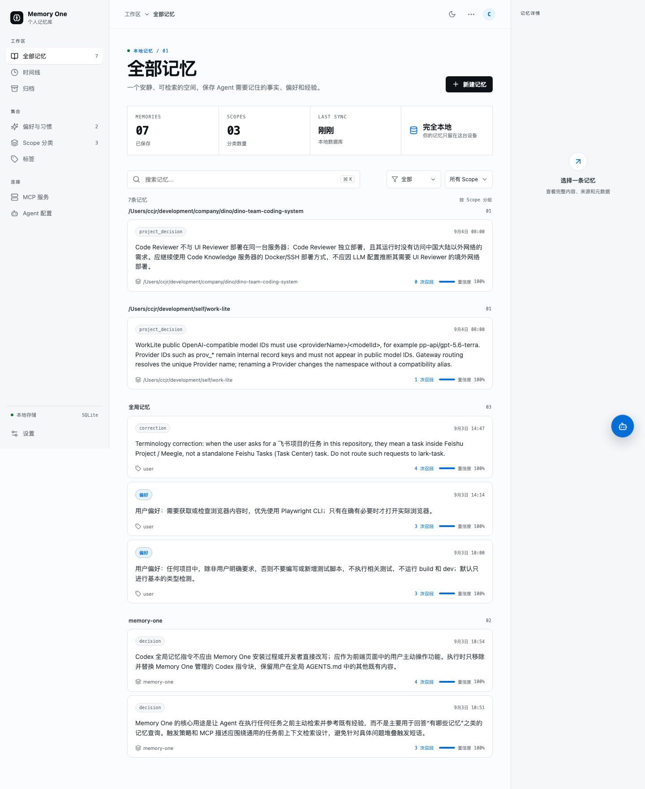
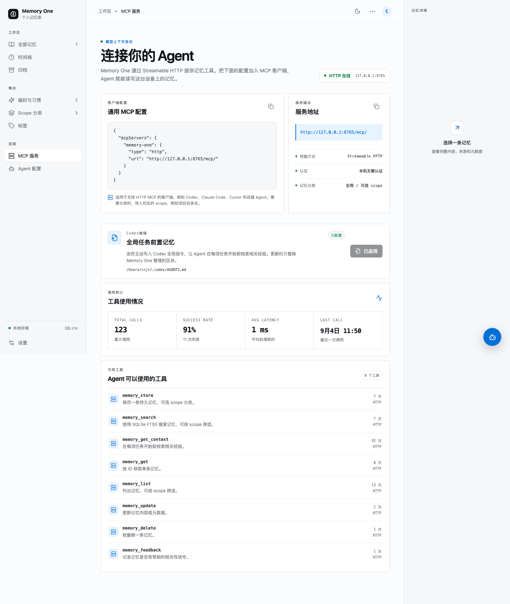

# Memory One

让 Agent 在开始工作前，先记住你的项目约定、个人偏好和已经验证过的经验。

Memory One 是一个运行在本机的长期记忆服务。你可以通过可视化工作台管理记忆，并通过 MCP 将这些记忆提供给 Codex、Claude Code、Cursor 或自建 Agent。所有数据默认保存在本机 SQLite 数据库中。

GitHub：https://github.com/ccjr1120/memory-one

## 1. 安装与启动

### 环境要求

- Node.js 20 或更高版本
- npm

### 安装

```bash
npm install --global @ccjr1120/memory-one
```

### 启动

```bash
memoryone start
```

首次启动时，命令行会让你选择 **中文** 或 **English**。之后可以在工作台的 **设置** 中修改界面语言。

启动后：

- 工作台：<http://127.0.0.1:23888/>
- MCP 地址：<http://127.0.0.1:23888/mcp/>

打开工作台：

```bash
memoryone open
```

如果端口 `23888` 已被占用，启动命令会询问是否终止占用进程。

## 2. 配置 MCP

打开工作台后，先将 Memory One MCP 接入你的 Agent：

1. 在左侧进入 **MCP 服务** 页面。
2. 默认开启 Bearer Key 认证。保持认证时，先在 **MCP Key 管理** 中创建 Key，并选择该 Agent 可以使用的工具。
3. 使用 Codex 时，在 **Codex → 连接与增强** 中选择 Key 并配置连接，然后在同一卡片中启用 **Codex 增强**。
4. 使用其他 Agent 时，复制页面中的 MCP 服务地址，并按客户端要求填写 Key。
5. 重启 Agent 或开启新会话。

Memory One 会检测 `~/.codex/config.toml` 中现有的 `memory-one` MCP 配置。单击配置后，只会替换该 MCP 服务的配置，并保留 Codex 的其他设置。

关闭 Bearer Key 认证后，整个 MCP 服务都不再要求 Key。Codex 自动配置也会移除 Authorization Header，此时无需创建或选择 Key。

Memory One 默认要求客户端通过 Bearer Key 访问 MCP 服务。复制的配置格式如下：

```json
{
  "mcpServers": {
    "memory-one": {
      "type": "http",
      "url": "http://127.0.0.1:23888/mcp/",
      "headers": {
        "Authorization": "Bearer <你的 Key>"
      }
    }
  }
}
```

建议为不同 Agent 分别创建 Key，并只授予所需工具权限。Key 保存在本机数据库中，可以随时回到管理页面复制或撤销。

Memory One 默认仅监听本机；如需从其他设备访问，还需要自行配置网络访问方式。

Codex 增强用于告诉 Codex 主动使用 Memory One，而不只是连接 MCP。在 Codex 卡片中单击 **启用全局记忆**；已有旧版指令时，单击 **更新全局指令**。

启用后，Codex 会被要求：

- 每项任务开始前调用一次 `memory_get_context`。
- 在 Git 项目中使用仓库根目录的绝对路径作为 `scope`。
- 将用户表达的长期偏好、决定、纠正和项目约定及时写入或更新到 Memory One。

Memory One 只会替换 `~/.codex/AGENTS.md` 中由自己管理的 `memory-one:codex` 标记区块，不会覆盖其他内容。该操作只会在你主动单击按钮后执行。

## 3. 开始使用

完成 MCP 配置后：

1. 在工作台右上角单击 **新建记忆**。
2. 保存一条希望 Agent 长期遵守的偏好或项目约定。
3. 在 Agent 中开始一个新任务，确认它调用了 `memory_get_context`。
4. 回到 **MCP 服务** 页面查看调用统计，或在 **全部记忆** 中检查新增和召回的记忆。

## 主要能力

- **长期保存经验**：记录偏好、事实、项目决策、工作流程和纠正意见。
- **任务前自动召回**：通过 `memory_get_context` 在 Agent 开始工作前读取相关经验。
- **区分项目与通用记忆**：使用可选的 `scope` 对记忆分类，同时支持项目记忆与全局记忆联合召回。
- **可视化管理**：搜索、筛选、新建、编辑和删除记忆，并查看召回次数与置信度。
- **本地存储**：默认仅监听本机地址，数据保存在本地 SQLite 数据库中。
- **调用可观察**：查看 MCP 调用次数、成功率、平均耗时和各工具使用情况。

## 界面预览

记忆总览：



MCP 服务与 Codex 配置：



## 使用内置记忆管家

点击工作台右下角的悬浮按钮可以打开记忆管家。它能够搜索、保存、更新和软删除记忆，也可以根据已有记忆总结你的偏好与特点。

首次使用需要完成模型配置：

1. 打开右下角的 Agent 面板并进入 **配置**。
2. 填写模型服务的 Base URL。
3. 选择请求格式并选择或填写模型。
4. 非本地模型服务需要填写 API Key。
5. 按需设置默认 Scope，以及是否在每轮对话前自动读取上下文。
6. 保存配置后开始对话。

模型配置保存在本机 SQLite 数据库中；记忆操作仍通过 Memory One 的 MCP 工具完成。

## MCP 工具

| 工具 | 用途 |
| --- | --- |
| `memory_get_context` | 在任务开始时检索相关经验 |
| `memory_search` | 按关键词搜索记忆，可选 `scope` |
| `memory_store` | 保存偏好、事实、决策、流程或纠正意见 |
| `memory_get` | 按 ID 读取单条完整记忆 |
| `memory_list` | 列出记忆，可选 `scope` |
| `memory_update` | 更新指定记忆的内容或元数据 |
| `memory_delete` | 软删除指定记忆，仅在用户明确要求时使用 |
| `memory_feedback` | 记录记忆是否有帮助，以改善后续召回 |

## Scope 使用建议

`scope` 是可选的分类字段，不是安全隔离边界。

- **项目记忆**：使用 Git 仓库根目录的绝对路径，例如 `/Users/name/code/my-project`。
- **通用记忆**：省略 `scope`。
- **其他分类**：也可以使用 `work`、`personal` 等自定义值。

`memory_get_context` 传入项目 `scope` 时，会联合召回该项目和全局记忆；省略 `scope` 时，只召回全局记忆。`memory_search` 省略 `scope` 时，可以跨分类搜索。

## CLI 命令

```bash
memoryone start   # 启动本地服务
memoryone stop    # 停止本地服务
memoryone status  # 查看运行状态
memoryone open    # 在浏览器中打开工作台
memoryone update  # 更新到最新版本
```

执行 `memoryone update` 时，如果服务正在运行，Memory One 会先停止服务，更新完成后再自动启动。

## 数据与备份

运行数据默认保存在：

```text
~/.local/share/memory-one/
```

其中：

- 数据库：`~/.local/share/memory-one/data/memory.db`
- PID：`~/.local/share/memory-one/memory-one.pid`
- 日志：`~/.local/share/memory-one/memory-one.log`

备份记忆时，建议先执行：

```bash
memoryone stop
```

然后复制 `memory.db` 文件。恢复时，在服务停止状态下用备份文件替换原数据库，再重新启动服务。

## 更新与卸载

更新到最新版本：

```bash
memoryone update
```

卸载程序：

```bash
memoryone stop
npm uninstall --global @ccjr1120/memory-one
```

卸载 npm 包不会自动删除 `~/.local/share/memory-one/` 中的数据库和配置。

## 常见问题

### 页面打不开

运行 `memoryone status` 检查服务状态；如果服务未运行，执行 `memoryone start`。启动失败时，查看：

```text
~/.local/share/memory-one/memory-one.log
```

### Agent 已连接 MCP，但没有主动读取记忆

确认以下事项：

1. Agent 已配置 Memory One MCP 地址。
2. 如果开启了 Bearer Key 认证，确认客户端已填写有效 Key，且 Key 已授权 `memory_get_context`。
3. 使用 Codex 时，确认已在 Codex 卡片中启用 **全局任务前置记忆**。
4. 启用后已经重启 Agent 或开启新会话。

### 记忆管家提示配置不完整

打开右下角 Agent 面板，在 **配置** 中检查 Base URL、请求格式、模型和 API Key。使用不需要鉴权的本地模型时，可以不填写 API Key。

### 如何确认 MCP 已连接

在 Agent 中调用一次 `memory_get_context`，然后打开工作台的 **MCP 服务** 页面查看调用统计。也可以让 Agent 保存一条测试记忆，再到 **全部记忆** 中搜索确认。
